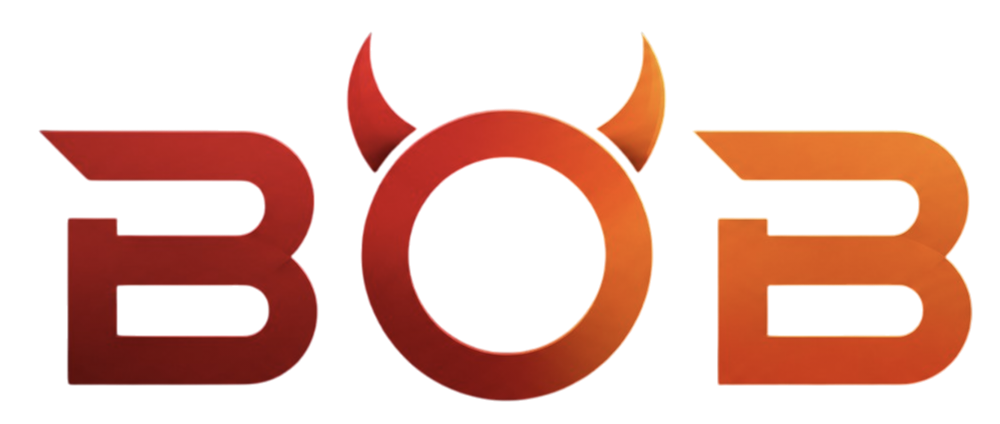

# txBOB — Predict, and Build At The Same Page

> Autonomous prediction market + Python SDK for World Cup 2026 on Solana.

<p align="center">
  
</p>

---

## What is txBOB?

txBOB combines two ideas from the OKX Agent Hackathon:

- **Prediction Market (Ide #8)** — users can predict micro-events in real-time: who scores next, will there be a yellow card, total goals, and more. Every outcome is rendered as a standalone Yes/No card, Polymarket-style.
- **Developer SDK (Ide #10)** — developers get a clean Python SDK to build their own prediction apps on top of the TxLINE oracle protocol.

All odds flow from the **TxLINE real-time sports oracle** and are transformed into implied probabilities — no raw decimal odds anywhere in the UI.

---

## Features

| Feature | Description |
|---------|-------------|
| 🎯 **True prediction-market cards** | Every outcome is a standalone Yes/No question with probability % |
| ⚡ **Real-time odds** | Streaming StablePrice feed from TxLINE oracle |
| 🎮 **Micro-markets** | Goal Scorer, Yellow Card, Penalty, Added Time per match |
| 🤖 **Autonomous resolver** | Background agent resolves predictions when matches finish |
| 🔌 **Python SDK** | `pip install txbob` — subscribe, activate, place orders on-chain |
| 👛 **Wallet connect** | Phantom, Backpack, Solflare — ready for on-chain settlement |
| 📱 **Responsive UI** | Dark/red theme, glassmorphism cards, smooth animations |

---

## Tech Stack

| Layer | Tech |
|-------|------|
| **Frontend** | React 18 + Vite + Tailwind CSS + Framer Motion |
| **Backend** | FastAPI (Python 3.9+) |
| **Database** | SQLite (predictions + markets) |
| **Oracle** | TxLINE Devnet REST + SSE streams |
| **Blockchain** | Solana Devnet (on-chain settlement — future) |

---

## Project Structure

```
txbob/
├── backend/
│   └── app/
│       ├── main.py              # FastAPI app + lifespan scheduler
│       ├── database.py          # SQLite schema + migrations
│       ├── resolver.py          # Autonomous prediction resolver
│       ├── scheduler.py         # Runs resolver every 60 seconds
│       ├── sdk.py               # TxLINE API client (JWT auth)
│       ├── models.py            # Pydantic response models
│       └── routes/
│           ├── fixtures.py      # GET /api/fixtures
│           ├── odds.py          # GET /api/odds/{id}, GET /api/matches
│           └── predictions.py   # POST/GET /api/predictions
├── frontend/
│   └── src/
│       ├── pages/
│       │   ├── Home.jsx         # Landing page
│       │   ├── Matches.jsx      # All matches + filters
│       │   ├── MatchDetail.jsx  # Match detail + predictions
│       │   └── Developers.jsx   # SDK documentation
│       ├── components/          # Navbar, BetModal, Toast, etc.
│       └── api/client.js        # API client with Vite proxy
├── sdk-python/
│   ├── txbob/client.py          # Core SDK client
│   ├── setup.py                 # pip install
│   └── examples/demo.py         # Usage examples
└── subscribe.js                 # On-chain subscription script (Solana)
```

## Installation & Setup

### Prerequisites

- Python 3.9+
- Node.js 18+
- npm 9+
- Solana CLI (optional, for on-chain features)

### 1. Clone the repo

```bash
git clone https://github.com/wumpomakeit/txbob.git
cd txbob
```

### 2. Backend

```bash
cd backend
python3 -m venv venv
source venv/bin/activate        # Windows: venv\Scripts\activate
pip install -r requirements.txt

# Start the server (includes scheduler for autonomous resolution)
uvicorn app.main:app --reload --port 8000
```

The backend starts two things:
- **REST API** at `http://localhost:8000`
- **Background scheduler** that runs the resolver agent every 60 seconds

### 3. Frontend

```bash
cd frontend
npm install
npm run dev
```

Open `http://localhost:5173` — the Vite dev server proxies `/api` requests to the backend automatically.

### 4. Python SDK (optional)

```bash
cd sdk-python
pip install -e .

# Quick test
python examples/demo.py
```

---

## TxLINE Integration

txBOB proxies all sports data through a FastAPI backend that talks to the TxLINE Devnet API.

| Endpoint | TxLINE Source | Purpose |
|----------|--------------|---------|
| `GET /api/fixtures` | `/api/fixtures/snapshot` | All matches (World Cup + Friendlies) |
| `GET /api/odds/{fixtureId}` | `/api/odds/snapshot/{fixtureId}` | Odds → probability transformation |
| `GET /api/scores/{fixtureId}` | `/api/scores/snapshot/{fixtureId}` | Match scores for resolver |
| `GET /api/scores/stream/{fixtureId}` | `/api/scores/stream/{fixtureId}` | SSE stream for live updates |

**Odds → Probability Conversion:**

```
raw_probability = 1 / decimal_odds
normalized = raw_probability / sum(all_raw_probabilities)
```

Only curated market types are kept: **1X2 Full Time**, **Over/Under 2.5**, **Both Teams to Score**.
Asian Handicaps and 1st Half sub-markets are filtered out.

---

## Resolver Agent

The autonomous resolver runs every 60 seconds and performs:

1. Fetch all fixtures → filter by `GameState == 2` (Finished)
2. For each finished fixture:
   - Fetch scores snapshot
   - Query all pending predictions
   - Compare selection vs actual result
   - Update status to `won` or `lost`
   - Mark market as `resolved`
3. Log results and continue

**Resolvable markets:** Match Winner (1X2), Over/Under 2.5, Both Teams to Score.

Micro-markets (Goal Scorer, Yellow Card, etc.) remain pending until score stream parsing is implemented.

---

## API Reference

### Predictions

| Method | Endpoint | Description |
|--------|----------|-------------|
| `POST` | `/api/predictions` | Place a new prediction |
| `GET` | `/api/predictions/{wallet}` | Get user's prediction history |
| `GET` | `/api/predictions/{id}/status` | Check a prediction's status |
| `POST` | `/api/predictions/resolve` | Trigger resolver manually |

### Fixtures & Odds

| Method | Endpoint | Description |
|--------|----------|-------------|
| `GET` | `/api/fixtures` | All fixtures from TxLINE |
| `GET` | `/api/odds/{fixtureId}` | Odds for a match |
| `GET` | `/api/matches` | Fixtures + odds merged |
| `GET` | `/api/scores/{fixtureId}` | Scores for a match |
| `GET` | `/api/scores/stream/{fixtureId}` | Real-time scores stream |

---

## Screenshots

<p align="center">
  <em>Screenshots coming soon — placeholders for now</em>
  <br/>
  
  
</p>

---

## Roadmap

- [x] TxLINE odds proxy with probability transformation
- [x] Prediction-market style Yes/No cards
- [x] Micro-markets (Goal Scorer, Yellow Card, Penalty, Added Time)
- [x] Wallet connect (Phantom, Backpack, Solflare)
- [x] SQLite prediction storage
- [x] Autonomous resolver agent
- [x] Python SDK
- [ ] On-chain settlement (Solana program)
- [ ] Real-time micro-market resolution from SSE stream
- [ ] Tournament bracket predictions
- [ ] Social features (leaderboard, copy-trading)

---

## License

MIT © 2026

---

<p align="center">
  Built with ❤️ for the OKX Agent Hackathon
</p>
